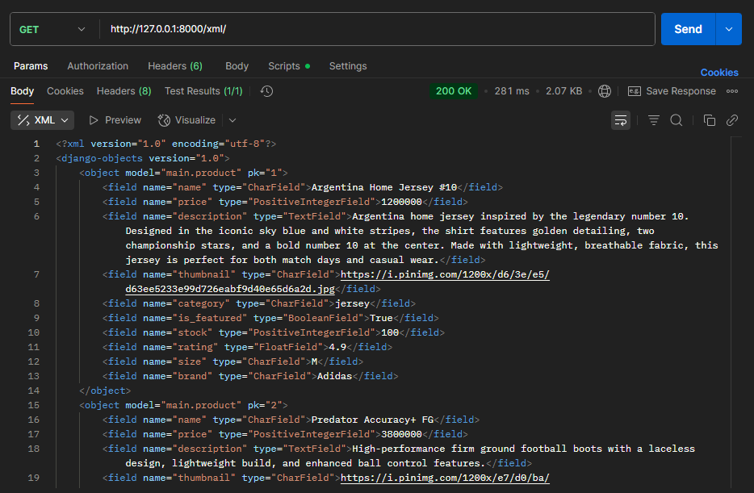
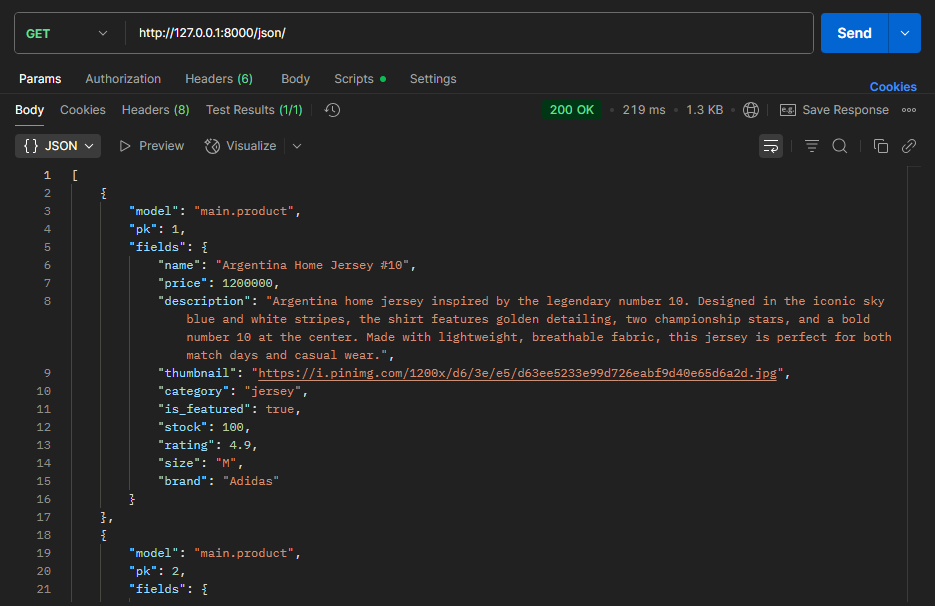
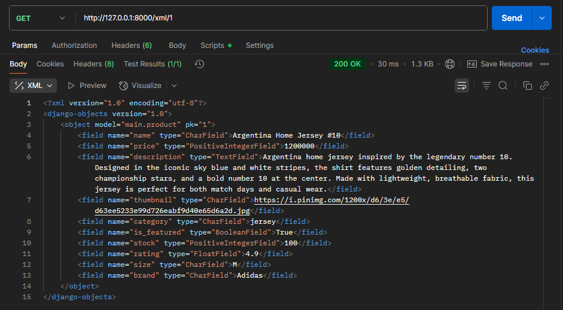
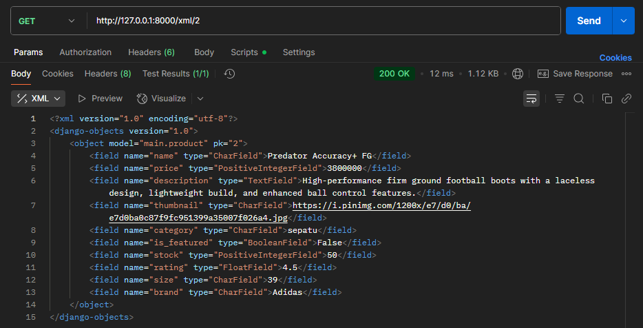
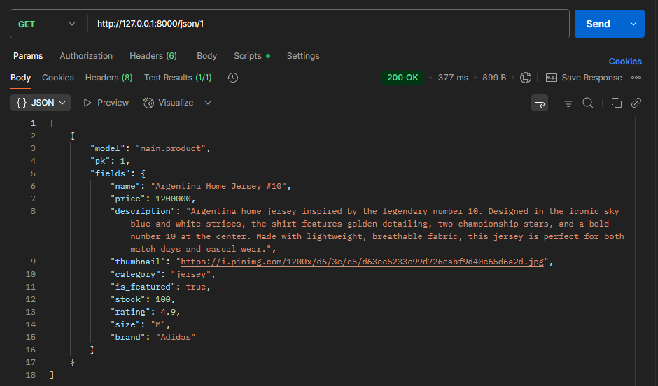
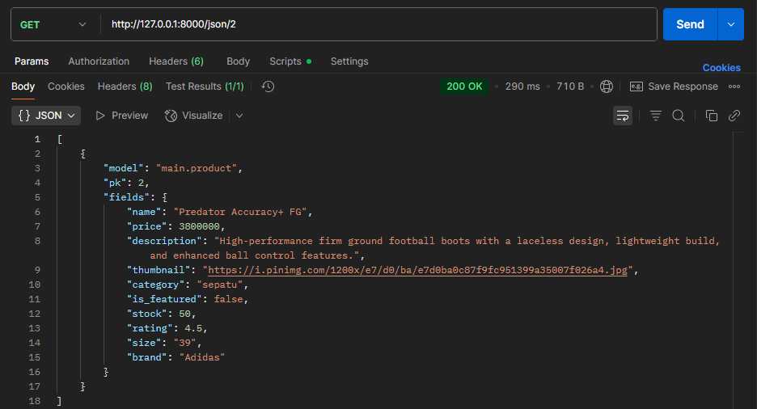

# Tugas Individu PBP Semester Ganjil 2025/2026
Abigail Namaratonggi P - 2406495773 - PBP C

Link menuju PWS depolyment-> https://abigail-namaratonggi-goaldenshop.pbp.cs.ui.ac.id/

<details>
<summary>Tugas 2: Implementasi Model-View-Template (MVT) pada Django</summary> 

## Jawaban Pertanyaan
### 1. Jelaskan bagaimana cara kamu mengimplementasikan checklist di atas secara step-by-step (bukan hanya sekadar mengikuti tutorial)
* **Membuat sebuah proyek Django baru**
    - Membuat direktori baru dengan nama `goalden-shop` dan membuat virtual environment.
    - Menyiapkan dependencies dan membuat proyek Django bernama `goalden_shop`. 
    - Membuat konfigurasi environment variables dan proyek, di mana saya menambahkan konfigurasi `.env` dan `.env.prod`. Di dalam `.env.prod`, saya membuat konfigurasi production sesuai dengan kredensial database yang diperoleh dan dengan schema `tugas_individu`. 
    - Mengunggahnya ke dalam repository GitHub baru dengan nama  `goalden-shop` dan membuat akun serta deployment melalui PWS.

* **Membuat aplikasi dengan nama main pada proyek**
    - Mengaktifkan virtual environment dan membuat aplikasi baru dengan nama `main`. 
    - Mendaftarkan aplikasi `main` ke dalam proyek dengan menambahkannya ke dalam `INSTALLED_APPS`.

* **Melakukan routing pada proyek**
   - Membuka `urls.py` yang ada di dalam direktori `goalden-shop`.
   - Impor fungsi `include` dari `django.urls` dan menambahkan rute URL di list `urlpatterns`untuk mengarahkan ke tampilan `main`.

* **Membuat model pada aplikasi main dengan nama Product dan memiliki atribut wajib**
    - Mengisi `models.py` dengan atribut `name`, `price`, `description`, `thumbnail`, `category`, `is_featured`, `stock`, `rating`, `size`, `brand`, `location`.
    - Melakukan migrasi model dengan `python manage.py makemigrations` dan `python manage.py migrate`.

* **Membuat sebuah fungsi pada views.py untuk dikembalikan ke dalam sebuah template HTML**
    - Mengimpor fungsi render dari modul `django.shortcuts` pada `views.py` yang berada di dalam `main`.
    - Menambahkan fungsi `show_main` yang berisikan `context`: `nama` dan `kelas` dan merender tampilan `main.html` dengan `return render(request, "main.html", context)`.
    - Mengubah `main.html` agar menampilkan nilai dari variable yang ada di `context`.

* **Membuat sebuah routing pada urls.py aplikasi main**
    - Membuat `urls.py` di dalam direktori `main`.
    - Mengisi `urls.py` dengan konfigurasi routing untuk aplikasi main.

* **Melakukan deployment ke PWS**
    - Akses PWS dan login.
    - Membuat proyek baru dengan nama `goaldenshop`.
    - Mengubah environment variables dengan `.env.prod` yang sudah dibuat.
    - Menambahkan `abigail-namaratonggi-goaldenshop.pbp.cs.ui.ac.id"` ke dalam list `ALLOWED_HOSTS`.
    - Simpan perubahan ke repository GitHub.
    - Jalankan perintah Project Command pada halaman PWS.


### 2. Buatlah bagan yang berisi request client ke web aplikasi berbasis Django beserta responnya dan jelaskan pada bagan tersebut kaitan antara urls.py, views.py, models.py, dan berkas html.


Link -> https://drive.google.com/file/d/1Q6WsjmPzmc3s093xb-9kpwdvAplgZJU1/view?usp=sharing

Pada bagan, alur Django dimulai ketika user mengirimkan HTTP Request ke server, lalu request tersebut diterima oleh `urls.py` untuk dicocokkan dengan alamat URL yang ada. Jika cocok, request diteruskan ke `views.py`. Jika dibutuhkan untuk menulis atau membaca database maka `views.py` akan berinteraksi dengan `models.py`. Data yang telah didapat kemudian dikirimkan ke template (.html) agar tampilannya sesuai. Hasil akhirnya adalah HTTP Response dalam bentuk HTML yang akan dikembalikan ke user.

### 3. Jelaskan peran settings.py dalam proyek Django!
`settings.py` berfungsi untuk mengatur project web. `settings.py` berisikan konfigurasi proyek seperti pengaturan keamanan (`SECRET_KEY`, `DEBUG`, dan `ALLOWED_HOSTS`), konfigurasi aplikasi dan middleware (`INSTALLED_APPS` dan `MIDDLEWARE`), pengaturan tampilan (`TEMPLATES`), pengelolaan database (`DATABASES`), dan `STATIC_URL`.

### 4. Bagaimana cara kerja migrasi database di Django?
Migrasi pada Django adalah cara untuk menerapkan perubahan model ke database. Perintah `python manage.py makemigrations` digunakan untuk membuat file migrasi yang isinya perubahan model yang belum diterapkan ke database. Setelah itu, `python manage.py migrate` akan menerapkan perubahan model tersebut ke database.

### 5. Menurut Anda, dari semua framework yang ada, mengapa framework Django dijadikan permulaan pembelajaran pengembangan perangkat lunak?
Django dijadikan permulaan pembelajaran pengembangan perangkat lunak karena membuat proses pengembangan aplikasi web lebih aman, cepat, dan mudah dimaintain. Django juga memiliki fitur bawaan untuk autentikasi pengguna, pengelolaan basis data, dan manajemen cookie sehingga developer tidak perlu menulis kode dari nol.

### 6. Apakah ada feedback untuk asisten dosen tutorial 1 yang telah kamu kerjakan sebelumnya?
Asdos tutorial 1 sangat membantu saya dalam mengikuti dan mengatasi kesulitan saat tutorial.
</details>

<details>
<summary>Tugas 3: Implementasi Form dan Data Delivery pada Django</summary>

## Jawaban Pertanyaan
### 1. Jelaskan mengapa kita memerlukan data delivery dalam pengimplementasian sebuah platform?
Data delivery digunakan sebagai penghubung antara server dan pengguna. Dengan data delivery, informasi data dapat dikirim dalam format seperti JSON atau XML sehingga dapat diakses lintas aplikasi. Hal ini memungkinkan pengguna mendapatkan informasi data secara real time dan membuat platform menjadi mudah dikembangkan karena data yang sama dapat dipakai berulang kali tanpa perlu diolah ulang.

### 2. Menurutmu, mana yang lebih baik antara XML dan JSON? Mengapa JSON lebih populer dibandingkan XML?
Menurut saya, JSON lebih baik dibandingkan XML untuk proses transfer data, karena lebih ringan dan cepat diproses. Walaupun XML masih sering diggunakan untuk menyimpan data dengan banyak variable dan struktur yang kompleks. JSON lebih popular dibandingkan XML karena memiliki syntax yang lebih ringkas sehingga lebih mudah dipahami oleh pengguna. JSON juga mudah dipakai di banyak bahasa pemrograman, terutama JavaScript.

### 3. Jelaskan fungsi dari method `is_valid()` pada form Django dan mengapa kita membutuhkan method tersebut? 
Method `is_valid()` berfungsi untuk memeriksa apakah data yang dimasukkan pengguna sudah sesuai dengan field dan aturan validasi yang ada di form. Jika semua valid, maka akan mengembalikan `True`, jika tidak, maka akan mengembalikan `False`. `is_valid()` dibutuhkan agar data yang dimasukkan tetap konsisten dan tidak menimbulkan error saat diproses ke database.

### 4. Mengapa kita membutuhkan `csrf_token` saat membuat form di Django? Apa yang dapat terjadi jika kita tidak menambahkan `csrf_token` pada form Django? Bagaimana hal tersebut dapat dimanfaatkan oleh penyerang?
`csrf_token` dipakai sebagai perlindungan dari pemalsuan permintaan lintas situs (CSRF).  `csrf_token` ditambahkan ke setiap form untuk memaastikan request berasal dari pengguna. Jika tidak menambahkan `csrf_token` form jadi rentan terhadap CSRF. Hal ini dimanfaatkan penyerang untuk menyamar sebagai user. Misalnya, penyerang membuat halaman berbahaya yang mengirim request ke server atas nama user, seperti melakukan transaksi tanpa sepengatahuan pemilik akun.

### 5. Jelaskan bagaimana cara kamu mengimplementasikan checklist di atas secara step-by-step (bukan hanya sekadar mengikuti tutorial).
* **Menambahkan 4 fungsi views baru untuk melihat objek yang sudah ditambahkan dalam format XML, JSON, XML by ID, dan JSON by ID.**
Menambahkan import `HttpResponse` dan `serializers` dan 4 fungsi views baru, yaitu `show_xml`, `show_json`, `show_xml_by_id`, dan `show_json_by_id`. Pada `show_xml_by_id` dan `show_json_by_id` saya menambahkan parameter `id` agar hanya data product tertentu yang ditampilkan. 
```python
def show_xml(request):
    products_list = Product.objects.all()
    xml_data = serializers.serialize("xml", products_list)
    return HttpResponse(xml_data, content_type="application/xml")

def show_json(request):
    products_list = Product.objects.all()
    json_data = serializers.serialize("json", products_list)
    return HttpResponse(json_data, content_type="application/json")

def show_xml_by_id(request, products_id):
    try:
        products_item = Product.objects.filter(pk=products_id)
        xml_data = serializers.serialize("xml", products_item)
        return HttpResponse(xml_data, content_type="application/xml")
    except Product.DoesNotExist:
        return HttpResponse(status=404)
    
def show_json_by_id(request, products_id):
    try:
        products_item = Product.objects.filter(pk=products_id)
        json_data = serializers.serialize("json", products_item)
        return HttpResponse(json_data, content_type="application/json")
    except Product.DoesNotExist:
        return HttpResponse(status=404)
```

* **Membuat routing URL untuk masing-masing `views` yang telah ditambahkan**
  - Mengimport fungsi `show_xml`, `show_json`, `show_xml_by_id`, dan `show_json_by_id` ke dalam `urls.py`.
  - Menambahkan path url ke dalam `urlpatterns`.
```python
...
path('xml/', show_xml, name='show_xml'),
path('json/', show_json, name='show_json'),
path('xml/<str:products_id>/', show_xml_by_id, name='show_xml_by_id'),
path('json/<str:products_id>/', show_json_by_id, name='show_json_by_id'),
...
 ```

* **Membuat halaman yang menampilkan data objek model yang memiliki tombol "Add" yang akan redirect ke halaman form, serta tombol "Detail" pada setiap data objek model yang akan menampilkan halaman detail objek**
  -  Menampilkan data produk dari `products_list` di `main.html` menggunakan tag ``. Jika kosong, akan menampilkan teks No products available yet.
  - Menambahkan tombol Add di `main.html` yang akan redirect ke halaman form penambahan product.
    ```html
    <a href="">
      <button>+ Add </button>
    </a>
    ```
  - Menambahkan tombol Detail pada setiap data product yang ditampilkan untuk menampilkan halaman detail product.
    ```html
    <p><a href="">
      <button>Detail</button>
    </a></p>
    ```

* **Membuat halaman `form` untuk menambahkan objek model pada app sebelumnya**
  - Membuat `forms.py` pada `main` dan tambahkan `ProductForm`.
  - Menambahkan fungsi `add_products` pada `views.py`.
    ```python
    def add_products(request):
        form = ProductForm(request.POST or None)

        if form.is_valid() and request.method == "POST":
            form.save()
            return redirect('main:show_main')

        context = {'form': form}
        return render(request, "add_products.html", context)
    ```
  - Membuat `add_products.html` pada `main/templates` yang menampilkan form untuk menambahkan produk baru. 
  - Menambahkan `path('add-products/', add_products, name='add_products')` ke dalam `urlpatterns`.

* **Membuat halaman yang menampilkan detail dari setiap data objek model**
  - Menambahkan fungsi `show_products` pada `views.py`.
    ```python
    def show_products(request, id):
        product = get_object_or_404(Product, pk=id)
        context = {
            'product': product
        }

        return render(request, "products_detail.html", context)
    ```
  - Membuat `products_detail.html` pada `main/templates` yang menampilkan detail lengkap produk. 
  - Menambahkan `path('product/<str:id>/', show_products, name='show_products'),` ke dalam `urlpatterns`.


### 6. Apakah ada feedback untuk asdos di tutorial 2 yang sudah kalian kerjakan?
Asdos tutorial 2 sangat membantu saya dalam mengikuti dan mengatasi kesulitan saat tutorial.

## Hasil Akses URL pada Postman
* **`http://127.0.0.1:8000/xml/`**


* **`http://127.0.0.1:8000/json/`**


* **`http://127.0.0.1:8000/xml/[product_id]`**



* **`http://127.0.0.1:8000/json/[product_id]`**


</details>

<details>
<summary>Tugas 4: Implementasi Autentikasi, Session, dan Cookies pada Django</summary> 

## Jawaban Pertanyaan
### 1. Apa itu Django `AuthenticationForm`? Jelaskan juga kelebihan dan kekurangannya
  `AuthenticationForm` adalah form bawaan Django yang dipakai untuk menangani proses login user. Form ini menyediakan field username dan password. Kelebihan dari `AuthenticationForm` adalah kita tidak perlu membuat form login dari awal. Selain itu, form ini juga melakukan validasi secara otomatis seperti mengecek apakah username terdaftar dan apakah password sesuai dengan user tersebut. Namun, `AuthenticationForm` memiliki kekurangan karena form ini belum memiliki fitur keamanan yang lebih seperti Two-Factor Authentication (2FA) dan mengunci akun jika salah password berulang kali.

### 2. Apa perbedaan antara autentikasi dan otorisasi? Bagaimana Django mengimplementasikan kedua konsep tersebut?
  Autentikasi (authentication) adalah proses untuk mengenali siapa penggunanya dan otorisasi (authorization) adalah proses untuk menentukan apa yang bisa diakses user tersebut. Django mengimplementasikan authentication dengan `django.contrib.auth` yang memiliki fungsi bawaan seperti `authenticate()`, `login()`, dan `logout()`. Sedangkan authorization dilakukan dengan sistem Permissions dan Groups. Pengecekan akses biasanya dilakukan dengan dekorator seperti `@login_required` yang mengatur agar hanya dapat diakses oleh user yang sudah login.

### 3. Apa saja kelebihan dan kekurangan session dan cookies dalam konteks menyimpan state di aplikasi web?
  Cookies memiliki kelebihan karena state dapat disimpan langsung di klien sehingga tidak membebani server. Selain itu, cookies juga otomatis terkirim ke setiap request HTTP sehingga memudahkan identifikasi user. Namun, cookies memiliki kekurangan, yaitu hanya dapat menyimpan 4 KB data. Sedangkan session memiliki kelebihan karena state disimpan di server sehingga lebih aman dan dapat menyimpan data dalam jumlah besar. Namun, session harus menyimpan data banyak pengguna aktif sehingga dapat membebani server. 

### 4. Apakah penggunaan cookies aman secara default dalam pengembangan web, atau apakah ada risiko potensial yang harus diwaspadai? Bagaimana Django menangani hal tersebut?
  Cookies tidak sepenuhnya aman karena dapat menimbulkan risiko seperti CSRF (Cross Site Request
  Forgery) di mana seseorang bisa memlakukan request dari origin yang tidak seharusnya, IDOR (Insecure Direct Object Reference) yang memungkinkan penyerang melakukan enumerasi terhadap ID sebuah object yang ada, atau CORS (Cross-Origin Resource Sharing) yang jika dikonfigurasi salah dapat memperbolehkan origin lain melakukan request ke suatu website atau API. Django menangani risiko ini dengan menyediakan proteksi CSRF bawaan melalui `CsrfViewMiddleware` yang aktif secara default dan menghasilkan token CSRF untuk memastikan setiap permintaan memang berasal dari user yang sesuai, penggunaan UUID pada model agar ID tidak mudah dienumerasi, serta memungkinkan pengaturan CORS agar akses hanya diberikan ke alamat tertentu yang memang diperlukan.

### 5. Jelaskan bagaimana cara kamu mengimplementasikan checklist di atas secara step-by-step
* **Mengimplementasikan fungsi registrasi, login, dan logout untuk memungkinkan pengguna mengakses aplikasi sebelumnya sesuai dengan status login/logoutnya**
  -  Membuka `views.py` dan menambahkan `UserCreationForm` dan `messages`.
    ```python
    from django.contrib.auth.forms import UserCreationForm
    from django.contrib import messages
    ```
  - Menambahkan fungsi `register` ke `views.py`.
     ```python
     def register(request):
    form = UserCreationForm()

    if request.method == "POST":
        form = UserCreationForm(request.POST)
        if form.is_valid():
            form.save()
            messages.success(request, 'Your account has been successfully created!')
            return redirect('main:login')
    context = {'form':form}
    return render(request, 'register.html', context)
    ```
  - Membuat berkas dan isi `register.html` pada `main/templates`.
  - Mengimport `register` ke dalam `urls.py` yang ada pada `main`.
  - Menambahkan `path('register/', register, name='register')` ke dalam `urlpatternns`.
  - Mengimport `authenticate`, `login`, dan `AuthenticationForm` pada `views.py` yang ada di `main`.
  - Menambahkan fungsi `login_user` ke dalam `views.py`
    ```python
      def login_user(request):
        if request.method == 'POST':
            form = AuthenticationForm(data=request.POST)

            if form.is_valid():
                  user = form.get_user()
                  login(request, user)
                  return redirect('main:show_main')

        else:
            form = AuthenticationForm(request)
        context = {'form': form}
        return render(request, 'login.html', context)
    ```
  - Membuat berkas dan isi `login.html` pada `main/templates`.
  - Mengimport `login_user` pada `urls.py` yang ada di `main` dan tambahkan ` path('login/', login_user, name='login')` ke dalam `urlpatterns`.
  - Mengimport `logout` pada `views.py` yang ada di `main`.
  - Menambahkan fungsi `logout_user` ke dlaam `views.py`
    ```python
      def logout_user(request):
        logout(request)
        return redirect('main:login')
    ```
  - Menambahkan kode ini ke dalam `main.html`
  ```html
    <a href="">
      <button>Logout</button>
    </a>
  ```
  - Mengimport `logout_user` pada `urls.py` yang ada di `main` dan tambahkan ` path('logout/',logout_user, name='logout')` ke dalam `urlpatterns`.

* **Membuat dua (2) akun pengguna dengan masing-masing tiga (3) dummy data menggunakan model yang telah dibuat sebelumnya untuk setiap akun di lokal**
  - Memmbuat akun pertama melalui registrasi dan login dengan akun tersebut.
  - Menambahkan tiga dummy data untuk akun pertama, yaitu Argentina Home Jersey #10, Nike Total 90, dan Nike Skills Football.
  - Logout dari akun pertama
  - Membuat akun kedua melalui registrasi.
  - Login menggunakan akun kedua dan membuat 3 duummy data lainnya, yaitu Nike Match Goalkeeper Football Gloves, Liverpool FC Socks 2 Pairs, dan The FIFA Ultimate Football Quiz Book.

* **Menghubungkan model Product dengan User**
  - Import `User` pada `models.py`.
  - Model Product dengan user dihubungkan dengan `ForeignKey`, yang menghubungkan satu product dengan satu user.
    ```python
    class Product(models.Model):
      user = models.ForeignKey(User, on_delete=models.CASCADE, null=True)
    ...
    ```
  `on_delete=models.CASCADE` artinya jika user dihapus, maka semua product dimiliki user tersebut juga akan terhapus.
  - Melakukan migrasi model.
  - Mengubah `add_product` menjadi seperti ini
    ```python
    def add_products(request):
    form = ProductForm(request.POST or None)

    if form.is_valid() and request.method == "POST":
        product_entry = form.save(commit = False)
        product_entry.user = request.user
        product_entry.save()
        return redirect('main:show_main')

    context = {'form': form}
    return render(request, "add_products.html", context)
    ```
  - Mengubah `show_main` menjadi seperti ini
    ```python
    @login_required(login_url='/login')
    def show_main(request):
        filter_type = request.GET.get("filter", "all")

        if filter_type == "all":
            products_list = Product.objects.all()
        else:
            products_list = Product.objects.filter(user=request.user)
        context = {
            'name': request.user.username,
            'class': 'PBP C',
            'products_list': products_list,
            'last_login': request.COOKIES.get('last_login', 'Never')
        }

        return render(request, "main.html", context)
    ```    
  - Menambahkan tombol filter My dan All pada `main.html`

* **Menampilkan detail informasi pengguna yang sedang logged in seperti username dan menerapkan cookies seperti last_login pada halaman utama aplikasi**
  - Menambahkan import `HttpResponseRedirect`, `reverse`, dan `datetime` pada `views.py` yang ada di `main`.
  - Mengubah fungsi `login_user` menjadi seperti ini
    ```python
    if form.is_valid():
      user = form.get_user()
      login(request, user)
      response = HttpResponseRedirect(reverse("main:show_main"))
      response.set_cookie('last_login', str(datetime.datetime.now()))
      return response
    ``` 
  - Menambahkan `'last_login': request.COOKIES.get('last_login', 'Never')` pada `context`.
  - Mengubah fungsi `logout_user` menjadi seperti ini
    ```python
    def logout_user(request):
      logout(request)
      response = HttpResponseRedirect(reverse('main:login'))
      response.delete_cookie('last_login')
      return response
    ```
  - Menambahkan `<h5>Sesi terakhir login: {{ last_login }}</h5>` pada `main.html`

</details>

<details>
<summary>Tugas 5: Desain Web menggunakan HTML, CSS dan Framework CSS</summary>
 
## Jawaban Pertanyaan
### 1. Jika terdapat beberapa CSS selector untuk suatu elemen HTML, jelaskan urutan prioritas pengambilan CSS selector tersebut!
Urutan dari prioritas tinggi ke rendah adalah:
* Inline Styles: Style ditulis langsung pada elemen HTML menggunakan `style="..."`. Contohnya adalah `<p style="color:red;">`.
* ID Selector: Ditandai dengan #, ID selector memiliki prioritas lebih tinggi daripada class atau tag selector. Contoh:  `#option { color: red; }`.
* Class Selector: Ditandai dengan tanda (.). Contoh: `.option { color: red; }.`
* Tag/Element Selector: Ini adalah selector dengan prioritas terendah, yang menargetkan semua elemen dengan tag HTML yang sama. `Contoh: 'p, h2 { color: red; }'`.

### 2. Mengapa responsive design menjadi konsep yang penting dalam pengembangan aplikasi web? Berikan contoh aplikasi yang sudah dan belum menerapkan responsive design, serta jelaskan mengapa!
Responsive design penting karena user mengakses web dari beragam ukuran layar, tidak hanya melalui desktop, tetapi juga dapat melalui device lain seperti smartphone, tablet, dan lainnya. Dengan adanya responsive design, tampilan situs web tetap terlihat baik, konsisten, dan mudah digunakan di berbagai perangkat. Contoh aplikasi yang sudah menerapkan responsive design adalah Instagram, sedangkan yang belum menerapkannya adalah SIAKNG.

### 3. Jelaskan perbedaan antara margin, border, dan padding, serta cara untuk mengimplementasikan ketiga hal tersebut!
* Margin: Merupakan ruang kosong transparan di luar elemen. Fungsinya adalah untuk memberikan jarak atau pemisah antara elemen tersebut dengan elemen lainnya.
* Border: Adalah garis yang mengelilingi elemen, berada di antara padding dan margin.
* Padding: Merupakan ruang kosong transparan di dalam elemen, yaitu di antara konten (teks/gambar) dan border

Cara mengimplementasikannya adalah seperti ini
```css
.box {
    margin: 20px;
    border: 10px solid black;
    padding: 15px;
}
```

### 4. Jelaskan konsep flex box dan grid layout beserta kegunaannya!
Flexbox dan Grid adalah model layout pada CSS yang digunakan untuk mengatur tata letak elemen-elemen di halaman web.
* Flexbox (Flexible Box): Model ini mengatur elemen dalam satu dimensi, baik secara horizontal (baris) maupun vertikal (kolom). Kegunaannya adalah untuk membuat elemen-elemen di dalam sebuah container dapat secara fleksibel menyesuaikan ukuran dan posisinya agar sesuai dengan ruang yang tersedia.
* Grid Layout: Model ini mengatur elemen dalam dua dimensi, yaitu baris dan kolom secara bersamaan. Kegunaannya adalah untuk membangun tata letak yang kompleks dan responsif dengan lebih mudah dan terstruktur.

### 5. Jelaskan bagaimana cara kamu mengimplementasikan checklist di atas secara step-by-step (bukan hanya sekadar mengikuti tutorial)!
* **Implementasikan fungsi untuk menghapus dan mengedit product.**
  - Membuat fungsi edit_products dan delete_products di views.py.
  - Menambahkan edit_products.html pada `main/templates`.
  - Mengimport fungsi `edit_products` ke dalam `urls.py` yang ada di `main` dan menambahkan path url ke `urlpatterns`.
  - Mengimport fungsi `delete_products` ke dalam `urls.py` yang ada di `main` dan menambahkan path url ke `urlpatterns`.
  - Menampilkan button edit dan delete pada `main.html`.
    ```html
    ...
    <a href="">
         <button>
             Edit
         </button>
     </a>
     <a href="">
      <button>
          Delete
      </button>
      ...
    ```
* **Kustomisasi desain pada template HTML yang telah dibuat**
  - Menghubungkan Tailwind CSS ke proyek dengan menambahkan script CDN (Content Delivery Network) ke dalam `base.html`.
  - Membuat file `global.css` untuk custom styling dan menghubungkannya ke `base.html`.
  - Kustomisasi halaman login, register, dan tambah product.
    * **[Login](main/templates/login.html)**
    * **[Register](main/templates/register.html)**
    * **[Add Product](main/templates/add_products.html)**
  - Membuat berkas `navbar.html` di direktori `templates/`. Kustomisasi navbar menjadi seperti [ini](templates/navbar.html). Saya menggunakan Tailwind seperti `hidden md:flex` untuk menyembunyikan menu navigasi di perangkat mobile dan menampilkannya di desktop.
  - Menggunakan tags include `` ke dalam `main.html`. 
  - Membuat berkas bernama `card_product.html` di direktori `main/templates/`. Kustomisasi card product menjadi seperti [ini](main/templates/card_products.html).
  - Menambahkan foto `no-product.png` ke direktori `static/image`.
</details>

<details>
<summary>Tugas 6: Javascript dan AJAX</summary>


## Jawaban Pertanyaan
### 1.  Apa perbedaan antara synchronous request dan asynchronous request?
* **synchronous request**
- Mencegah DOM atau browser mengeksekusi additional code sampai server merespon.
- Kode setelah request tidak akan jalan sampai server memberi jawaban.
- `async: false`.
- Browser dapat terhenti sementara, karena menunggu respons server.
* **asynchronous request**
- Tidak mencegah DOM atau browser mengeksekusi additional code sampai server merespon.
- Browser tidak menunggu server merespon, sehingga kode berikutnya tetap dijalankan.
- `async: true`.
- User tetap bisa berinteraksi dengan halaman, tanpa harus menunggu server.

### 2. Bagaimana AJAX bekerja di Django (alur request–response)?
- User action (misal: klik tombol "Add Product" atau "Delete").
- JavaScript membuat objek untuk mengirim request ke server.
- Browser mengirim request (GET/POST) ke server.
- Server memproses request dan mengirim response kembali.
- JavaScript membaca response tersebut dan menjalankan aksi berikutnya sesuai instruksi

### 3. Apa keuntungan menggunakan AJAX dibandingkan render biasa di Django?
- Tidak perlu reload halaman, sehingga menjadi lebih cepat dan smooth.
- Respons lebih cepat dan responsif karena hanya data yang diperlukan dikirim.
- Bisa melakukan request secara asinkron
- Mengurangi penggunaan bandwidth dan meningkatkan kecepatan.

### 4. Bagaimana cara memastikan keamanan saat menggunakan AJAX untuk fitur Login dan Register di Django?
Untuk memastikan keamanan fitur Login dan Register yang menggunakan AJAX di Django, kita perlu menggunakan CSRF token di setiap request POST, kemudian lakukan validasi input di server. Selain itu kita juga dapat menggunakan HTTPS agar data sensitif seperti password tidak mudah disadap.

### 5. Bagaimana AJAX mempengaruhi pengalaman pengguna (User Experience) pada website?
Website yang menggunakan AJAX tentu akan menjadi lebih menarik serta cepat tanpa harus berganti halaman saat melakukan suatu tindakan. Hal ini dikarenakan hanya bagian tertentu yang diupdate, sehingga tidak perlu reload halaman. AJAX juga menghemat waktu pengguna karena hanya data yang diperlukan yang dikirim dan diterima dari server.