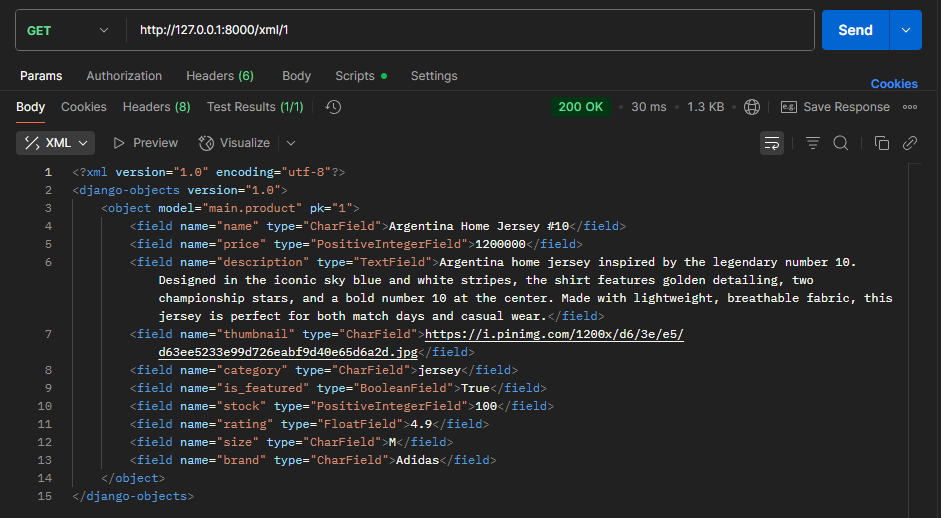

# Tugas Individu 3 - PBP 
Abigail Namaratonggi P - 2406495773 - PBP C

## Jawaban Pertanyaan
### 1. Jelaskan mengapa kita memerlukan data delivery dalam pengimplementasian sebuah platform?
Data delivery digunakan sebagai penghubung antara server dan pengguna. Dengan data delivery, informasi data dapat dikirim dalam format seperti JSON atau XML sehingga dapat diakses lintas aplikasi. Hal ini memungkinkan pengguna mendapatkan informasi data secara real time dan membuat platform menjadi mudah dikembangkan karena data yang sama dapat dipakai berulang kali tanpa perlu diolah ulang.

### 2. Menurutmu, mana yang lebih baik antara XML dan JSON? Mengapa JSON lebih populer dibandingkan XML?
Menurut saya, JSON lebih baik dibandingkan XML untuk proses transfer data, karena lebih ringan dan cepat diproses. Walaupun XML masih sering diggunakan untuk menyimpan data dengan banyak variable dan struktur yang kompleks. JSON lebih popular dibandingkan XML karena memiliki syntax yang lebih ringkas sehingga lebih mudah dipahami oleh pengguna. JSON juga mudah dipakai di banyak bahasa pemrograman, terutama JavaScript.

### 3. Jelaskan fungsi dari method `is_valid()` pada form Django dan mengapa kita membutuhkan method tersebut? 
Method `is_valid()` berfungsi untuk memeriksa apakah data yang dimasukkan pengguna sudah sesuai dengan field dan aturan validasi yang ada di form. Jika semua valid, maka akan mengembalikan `True`, jika tidak, maka akan mengembalikan `False`. `is_valid()` dibutuhkan agar data yang dimasukkan tetap konsisten dan tidak menimbulkan error saat diproses ke database.

### 4. Mengapa kita membutuhkan `csrf_token` saat membuat form di Django? Apa yang dapat terjadi jika kita tidak menambahkan `csrf_token` pada form Django? Bagaimana hal tersebut dapat dimanfaatkan oleh penyerang?
`csrf_token` dipakai sebagai perlindungan dari pemalsuan permintaan lintas situs (CSRF).  `csrf_token` ditambahkan ke setiap form untuk memaastikan request berasal dari pengguna. Jika tidak menambahkan `csrf_token` form jadi rentan terhadap CSRF. Hal ini dimanfaatkan penyerang untuk menyamar sebagai user. Misalnya, penyerang membuat halaman berbahaya yang mengirim request ke server atas nama user, seperti melakukan transaksi tanpa sepengatahuan pemilik akun.

### 5. Jelaskan bagaimana cara kamu mengimplementasikan checklist di atas secara step-by-step (bukan hanya sekadar mengikuti tutorial).
* **Menambahkan 4 fungsi views baru untuk melihat objek yang sudah ditambahkan dalam format XML, JSON, XML by ID, dan JSON by ID.**
Menambahkan import `HttpResponse` dan `serializers` dan 4 fungsi views baru, yaitu `show_xml`, `show_json`, `show_xml_by_id`, dan `show_json_by_id`. Pada `show_xml_by_id` dan `show_json_by_id` saya menambahkan parameter `id` agar hanya data product tertentu yang ditampilkan. 
```python
def show_xml(request):
    products_list = Product.objects.all()
    xml_data = serializers.serialize("xml", products_list)
    return HttpResponse(xml_data, content_type="application/xml")

def show_json(request):
    products_list = Product.objects.all()
    json_data = serializers.serialize("json", products_list)
    return HttpResponse(json_data, content_type="application/json")

def show_xml_by_id(request, products_id):
    try:
        products_item = Product.objects.filter(pk=products_id)
        xml_data = serializers.serialize("xml", products_item)
        return HttpResponse(xml_data, content_type="application/xml")
    except Product.DoesNotExist:
        return HttpResponse(status=404)
    
def show_json_by_id(request, products_id):
    try:
        products_item = Product.objects.filter(pk=products_id)
        json_data = serializers.serialize("json", products_item)
        return HttpResponse(json_data, content_type="application/json")
    except Product.DoesNotExist:
        return HttpResponse(status=404)
```

* **Membuat routing URL untuk masing-masing `views` yang telah ditambahkan**
   - Mengimport fungsi `show_xml`, `show_json`, `show_xml_by_id`, dan `show_json_by_id` ke dalam `urls.py`.
   - Menambahkan path url ke dalam `urlpatterns`.
```python
...
path('xml/', show_xml, name='show_xml'),
path('json/', show_json, name='show_json'),
path('xml/<str:products_id>/', show_xml_by_id, name='show_xml_by_id'),
path('json/<str:products_id>/', show_json_by_id, name='show_json_by_id'),
...
 ```

* **Membuat halaman yang menampilkan data objek model yang memiliki tombol "Add" yang akan redirect ke halaman form, serta tombol "Detail" pada setiap data objek model yang akan menampilkan halaman detail objek**
   -  Menampilkan data produk dari `products_list` di `main.html` menggunakan tag ``. Jika kosong, akan menampilkan teks No products available yet.
   - Menambahkan tombol Add di `main.html` yang akan redirect ke halaman form penambahan product.
```html
<a href="">
  <button>+ Add </button>
</a>
```
   - Menambahkan tombol Detail pada setiap data product yang ditampilkan untuk menampilkan halaman detail product.
```html
<p><a href="">
  <button>Detail</button>
</a></p>
```

* **Membuat halaman `form` untuk menambahkan objek model pada app sebelumnya**
   - Membuat `forms.py` pada `main` dan tambahkan `ProductForm`.
   - Menambahkan fungsi `add_products` pada `views.py`.
```python
def add_products(request):
    form = ProductForm(request.POST or None)

    if form.is_valid() and request.method == "POST":
        form.save()
        return redirect('main:show_main')

    context = {'form': form}
    return render(request, "add_products.html", context)
```
   - Membuat `add_products.html` pada `main/templates` yang menampilkan form untuk menambahkan produk baru. 
   - Menambahkan `path('add-products/', add_products, name='add_products')` ke dalam `urlpatterns`.

* **Membuat halaman yang menampilkan detail dari setiap data objek model**
   - Menambahkan fungsi `show_products` pada `views.py`.
```python
def show_products(request, id):
    product = get_object_or_404(Product, pk=id)
    context = {
        'product': product
    }

    return render(request, "products_detail.html", context)
```
   - Membuat `products_detail.html` pada `main/templates` yang menampilkan detail lengkap produk. 
   - Menambahkan `path('product/<str:id>/', show_products, name='show_products'),` ke dalam `urlpatterns`.


### 6. Apakah ada feedback untuk asdos di tutorial 2 yang sudah kalian kerjakan?
Asdos tutorial 2 sangat membantu saya dalam mengikuti dan mengatasi kesulitan saat tutorial.

## Hasil Akses URL pada Postman
* **`http://127.0.0.1:8000/xml/`**


* **`http://127.0.0.1:8000/json/`**


* **`http://127.0.0.1:8000/xml/[product_id]`**



* **`http://127.0.0.1:8000/json/[product_id]`**

